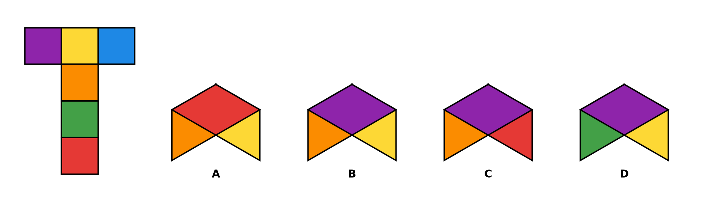
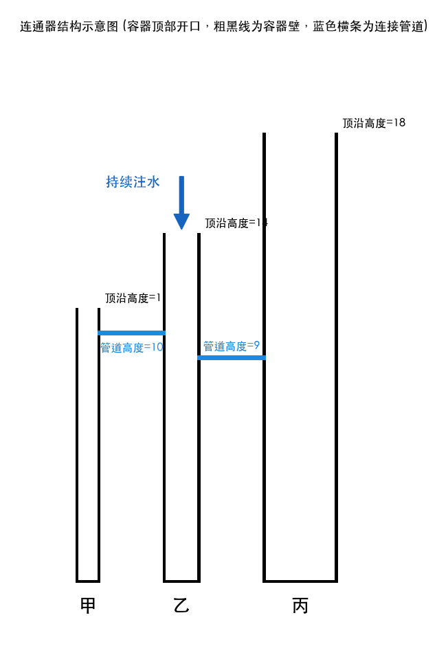

# Procedural Visual Reasoning

一个生成中文视觉推理数据的程序化工具包。它从结构化场景出发，通过确定性求解器同步生成图片、问题、答案和程序化解释，并能从保存的场景参数重新计算标签。

仓库同时提供可直接使用的数据和生成代码，适合小规模 SFT、数据生成管线研究和能力诊断。它**不是**通用视觉推理基准；仓库内的 test split 仍来自同一生成体系，不代表对外部任务的迁移能力。

| 固定朝向的可见三面 | 读图连通器 |
|---|---|
|  |  |

## 快速开始

```bash
git clone https://github.com/L77-Labs/procedural-visual-reasoning.git
cd procedural-visual-reasoning
python scripts/verify_pack.py
```

仓库约 387 MB，主要由已经渲染好的 PNG 构成。加载和验证现有数据只需要 Python 3.10+，不需要安装第三方依赖。

加载默认推荐的 1776 条训练记录：

```python
from scripts.load_sft import load_sft

train = load_sft(".")
cube_only = load_sft(".", subsets=["cube_fold"])
```

加载器和验证器只使用 Python 标准库。重新渲染图片时安装：

```bash
python -m pip install -r requirements-render.txt
```

## 推荐 SFT

`load_sft()` 只读取下列两个子集的 `split=train`。同一 `scene_id` 不跨 split。

| 子集 | 全部 | train | test | 内容与标签来源 |
|---|---:|---:|---:|---|
| `cube_fold/` | 900 | 795 | 105 | 固定轴测朝向的可见三面四选一；折叠几何 |
| `vessels/` | 1281 | 981 | 300 | 溢出、进不了水、终态水位；简化物理事件模拟 |

`vessels` 的 test 是独立留出的 100 个 5/6 容器场景，每场景三问。train 中也含 5/6 容器，因此它不是“容器数量 OOD”。

## 诊断与失败对照

这些数据随仓库公开，但不会被默认加载：

| 子集 | 条数 | `use` | 用途 |
|---|---:|---|---|
| `cube_opposite/` | 900 | `diagnostic` | 对面颜色任务；不作为默认空间 SFT |
| `structure_count/` | 250 | `probe` | 线稿组合计数；10 条 `split=test` 禁止训练 |
| `leak_contrast/` | 300 | `contrast` | 保留答案字母泄漏的教师解释，用于检查和研究数据泄漏风险 |

## 生成新数据

生成 20 条固定朝向可见三面题：

```bash
python scripts/generate_cube_fold_v3.py \
  --count 20 \
  --seed 42 \
  --out-dir outputs/cube_visible_20
```

生成 20 个四容器连通器场景（每个场景生成三种问题，共 60 条记录）：

```bash
python scripts/generate_vessels_v2.py \
  --count 20 \
  --n-vessels 4 \
  --seed 2026 \
  --out-dir outputs/vessels_20
```

## 记录格式

每行 JSON 的核心字段如下；完整定义见 [`schema.json`](schema.json)。

```json
{
  "id": "cube_fold_0000_visible",
  "scene_id": "cube_fold_0000",
  "image": "images/visible/cube_fold_0000.png",
  "question": "……",
  "answer": "B",
  "rationale": "……",
  "rationale_source": "geometry",
  "split": "train",
  "use": "sft",
  "scene": {}
}
```

标签及程序化 `rationale` 可由几何、物理模拟或组合公式重算。教师解释只检查来源、格式和答案泄漏，不保证逐句正确。

图片路径均相对于所在子集目录；训练时可将 `image` 与对应子集路径拼接。字段语义、枚举值和可空字段以 [`schema.json`](schema.json) 为准。

## 验证范围

```bash
python scripts/verify_pack.py
```

验证器会检查：

- 图片存在、记录数量、用途和 split；
- 正方体答案的折叠几何与唯一性；
- 连通器答案和程序化事件解释；
- 结构计数公式与冻结参数隔离；
- 教师来源字段及泄漏对照的实际命中率。

## 已知边界

- 可见三面只问图中的固定轴测朝向，不覆盖任意视角。
- 连通器采用离散事件模型：水位达到管道阈值时触发瞬时连通，并以矩形截面计算水量和平衡状态。该定义保证标签可确定重算，不用于近似真实流体动力学。
- 部分 5–6 容器图可能出现标签贴墙或叠字，数字仍可读。
- train/test 共享生成器、视觉语言和模板风格，test 不是外部通用基准。
- 部分教师解释由阿里云百炼正式 API 的 `qwen3.8-max` 生成，未逐句程序核验。

## 文档

- [`DATA_CARD.md`](DATA_CARD.md)：数据来源、用途、证据等级和限制
- [`METHODOLOGY.md`](METHODOLOGY.md)：场景程序、求解、渲染与验证链路
- [`HISTORICAL_EXPERIMENTS.md`](HISTORICAL_EXPERIMENTS.md)：不可独立复核的旧实验观察
- [`scripts/README.md`](scripts/README.md)：稳定公共脚本与维护工具边界
- 各子集目录中的 `README.md`：任务特定说明

仓库不包含第三方评测集的原题或原图。

## 反馈

如果你验证了数据包、生成了新记录，或将其中一个子集用于训练或评测，欢迎提交 [使用反馈](https://github.com/L77-Labs/procedural-visual-reasoning/issues/new?template=usage-feedback.yml)。运行失败时，请附上环境、命令和完整报错；实验反馈可只报告你愿意公开的配置与结果。

## 许可

- 生成器与工具代码：MIT，见 [`LICENSE`](LICENSE)
- 图、题、答案、场景参数和解释：CC BY 4.0，见 [`LICENSE-DATA`](LICENSE-DATA)

使用或再分发数据时，请注明项目名称、仓库地址，以及教师解释所标注的模型来源。引用元数据见 [`CITATION.cff`](CITATION.cff)。

维护者发布新版本前可安装 `requirements-dev.txt`，再运行 `python scripts/release_check.py`；未安装开发依赖时仍会执行其余标准库检查。
